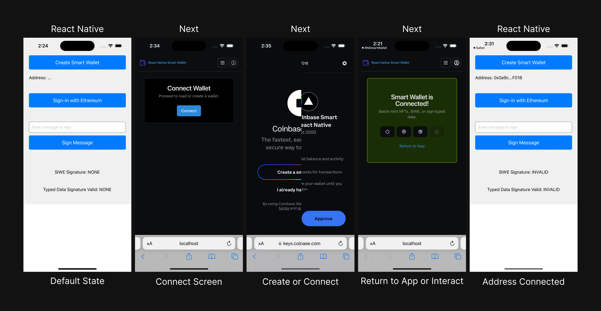
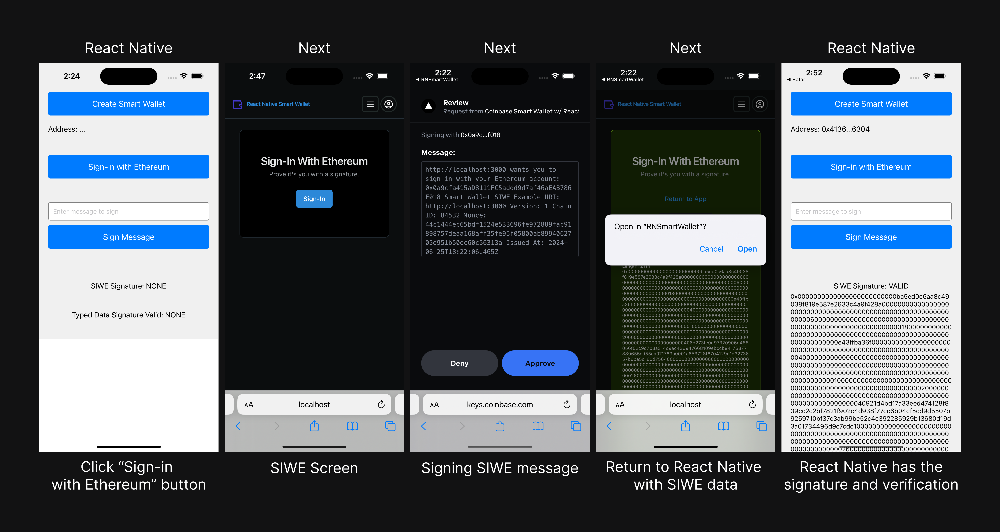

<<<<<<< HEAD
# react-native-smart-wallet-connector
Next.JS Connector for mobile apps building with Coinbase Smart Wallets
=======
# ocs-hackathon

## Smart Wallet on Mobile

For the Coinbase Onchain Summer Buildathon we built a React Native application that communicates to a Next.js application to create/connect a Coinbase Smart Wallet, then sign messages such as SIWE or batch transactions and return to the React Native app with some state from a deeplink URL.

### Connect Address

<<<<<<< HEAD
>>>>>>> 5ae47eb (➕ Add connect/create demo)
=======

### Sign-in with Ethereum (SIWE)

>>>>>>> d31f617 (➕ Add siwe demo image)
