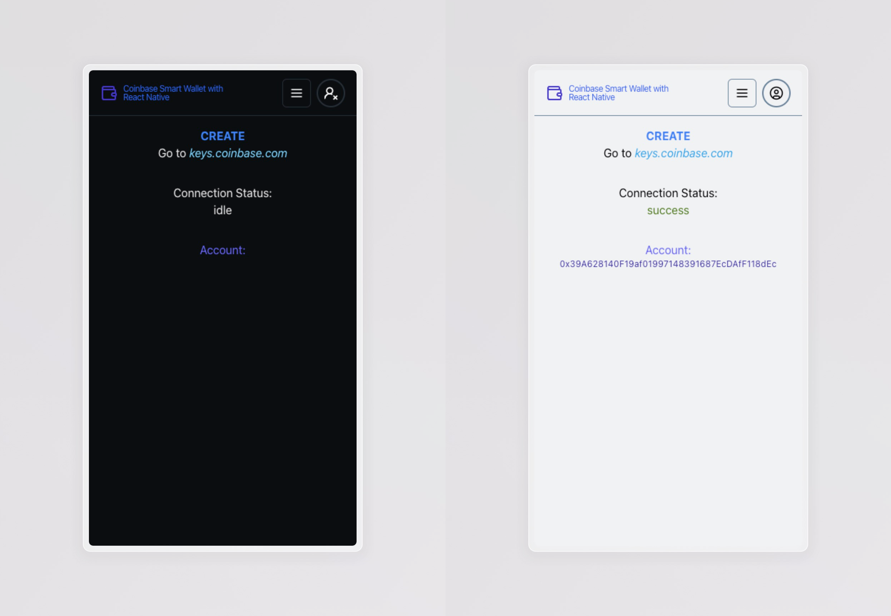
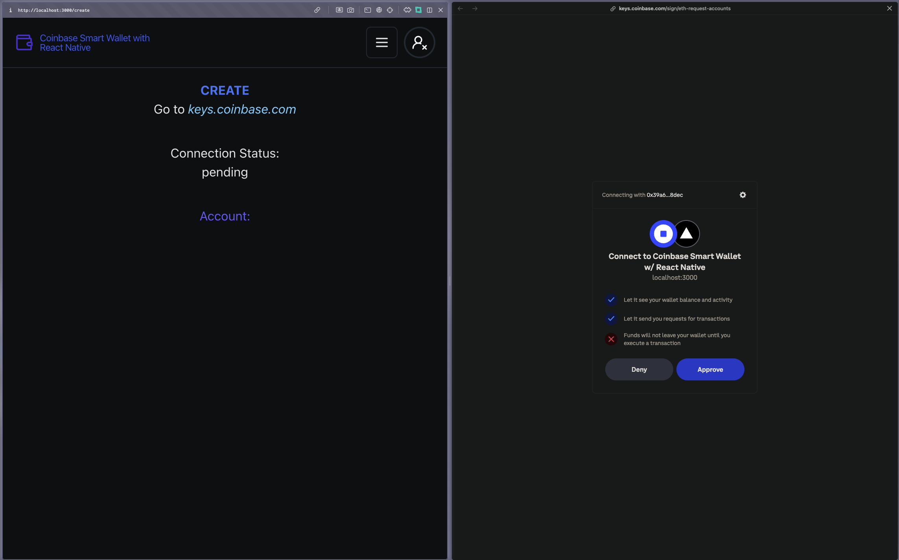

# Trumen World Smart Wallet App

Production URL: [TO BE DETERMINED](https://tbd.com)

---




---

## Instructions

### Clone

First, clone the web app:

```bash
git clone https://github.com/trumen-world/ocs-hackathon
```

### Install

Next, install the app's dependencies:

```bash
bun i
```

> Don't have Bun? Install it [here](https://bun.sh/docs/installation).

### Configure Environment Variables

Then, configure the app's environment variables. First, copy the default/example variables to become local environment variables:

```bash
cp .env.example .env.local
```

Second, add your [WalletConnect](https://cloud.walletconnect.com/sign-in) **Project ID** for `NEXT_PUBLIC_WC_PROJECT_ID`.

Third, replace `<API_KEY>` with an **API Key** from [Alchemy](https://dashboard.alchemy.com/apps) for `NEXT_PUBLIC_WC_PROJECT_ID`.


### Starting the App

First, run the development server:

```bash
bun dev
```

Open [http://localhost:3000](http://localhost:3000) with your browser to see the result.

This project uses [`next/font`](https://nextjs.org/docs/basic-features/font-optimization) to automatically optimize and load custom Google Fonts.

---

## Blockchain

### Configuration

Easily manage the chains, wallet providers and transport layers of the app using wagmi:

```typescript
// lib/wagmi.ts
export const config = createConfig({
  chains: [mainnet, base],
  connectors: [
    injected(),
    coinbaseWallet({
      appName: "Trumen World",
      preference: "smartWalletOnly"
    }),
    walletConnect({ projectId: process.env.NEXT_PUBLIC_WC_PROJECT_ID! }),
  ],
  ssr: true,
  transports,
});
```

> The current configuration allows for injected wallets, Coinbase Wallet, Wallet Connect supported wallets and Frame.

### Connecting Wallets

Connecting, checking the status and errors of the user wallet is simple:

```typescript
// components/ConnectSelect.tsx
import { useConnect } from "wagmi";

export function ConnectSelect() {
const { connectors, connect, status, error } = useConnect();

function onSubmit(data: z.infer<typeof FormSchema>) {
  let connector = connectors.find(
    (connector) => connector.name === data.connector,
  );
  if (connector) connect({ connector });
}
```

### Smart Contract Interaction

Simulate contract write requests using the public client (READ) before using the wallet client (WRITE) to interact with a contract:

```typescript
// component/Statistics.tsx
const [user] = useUser();
const handleRebase = async () => {
  const { request } = await client.simulateContract({
    account: user.account?.address,
    address: TRUMEN_NFT_CONTRACT.address,
    abi: TRUMEN_NFT_CONTRACT.abi,
    chain: base,
    functionName: "mint",
  });
  await walletClient.writeContract(request);
};
```
